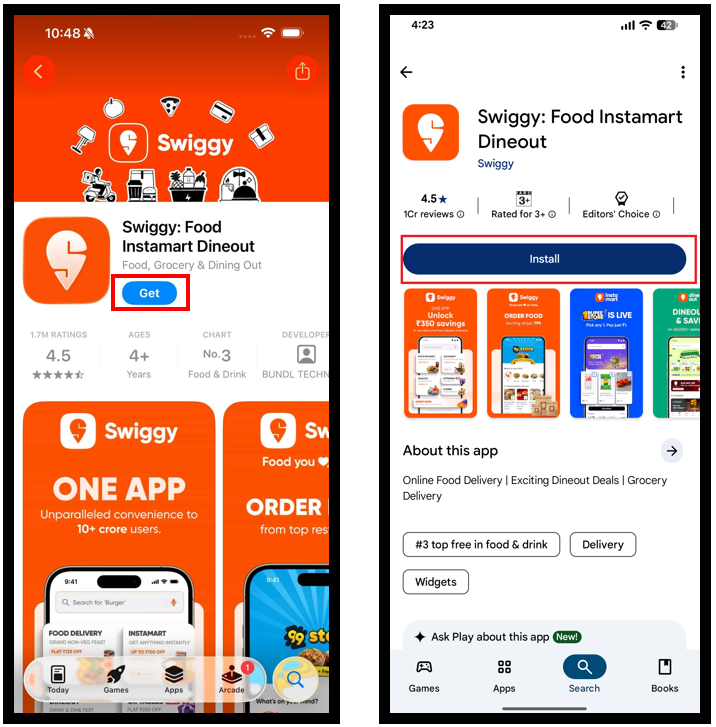
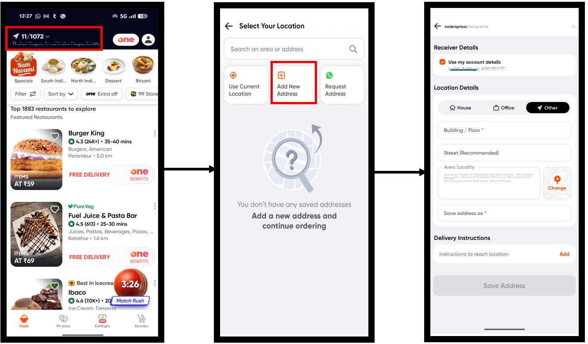
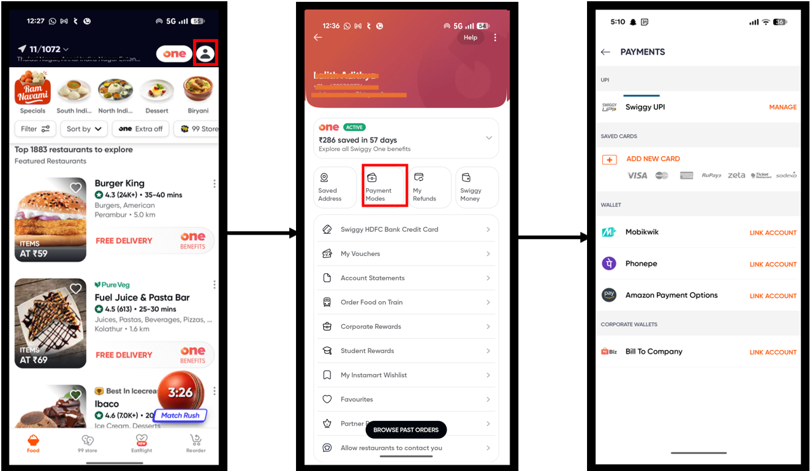
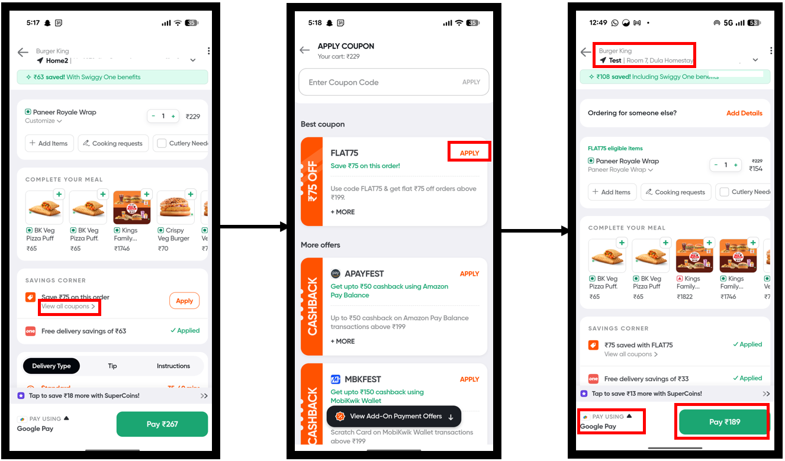
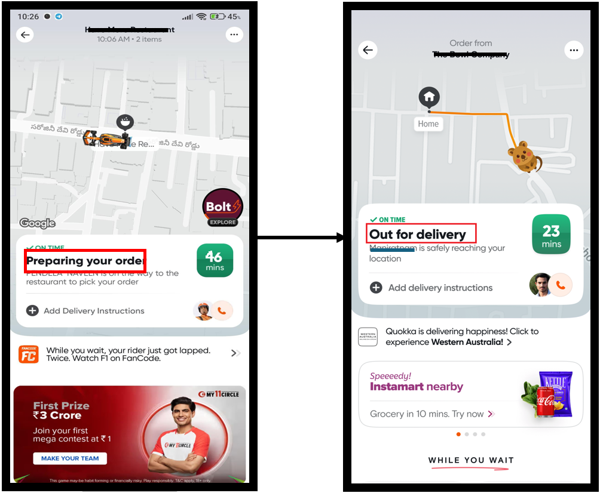
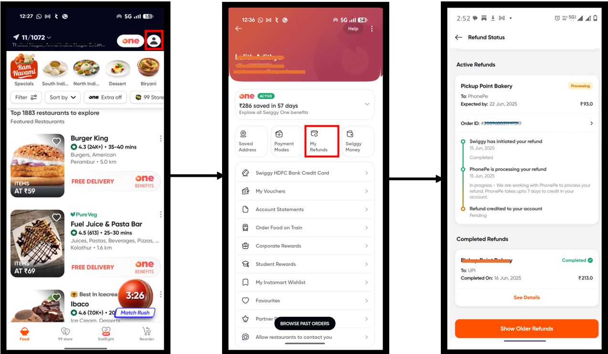

---
# Swiggy Mobile App User Manual
## Technical Writing Portfolio Sample

---

## Document Information

| Field | Details |
|-------|---------|
| **Document Title** | Swiggy Mobile App User Manual v4.2 |
| **Platform** | iOS / Android |
| **Target Audience** | New users and existing users seeking comprehensive guidance |
| **Document Type** | User Guide / Portfolio Sample |

---

## Design Rationale

| Aspect | My Approach |
|--------|-------------|
| **Documentation Philosophy** | Task-based minimalism - users seek answers to specific tasks, not feature lists |
| **Structure** | Organized by user goals (ordering, tracking, troubleshooting) rather than app features |
| **Writing Style** | Microsoft Style Guide - consistent terminology ("tap"), active voice, second person |
| **Visual Strategy** | Text on left, annotated screenshots on right for easy scanning |
| **Scope** | Focused on core user journeys that represent 80% of user tasks |

---

## Table of Contents

1. [Getting Started](#1-getting-started)
2. [Placing Your First Order](#2-placing-your-first-order)
3. [Managing Your Order](#3-managing-your-order)
4. [Handling Issues](#4-handling-issues)

---

## 1. Getting Started

### 1.1 Downloading and Installing the App

<table>
  <tr>
    <td width="50%">
      <strong>📱 For iOS Users</strong>  
      <ol>
        <li>Open the App Store</li>
        <li>Tap the search tab</li>
        <li>Type "Swiggy"</li>
        <li>Tap <strong>Get</strong> next to the Swiggy app</li>
        <li>Authenticate with Face ID or password</li>
      </ol>
       
      <strong>🤖 For Android Users</strong>  
      <ol>
        <li>Open the Google Play Store</li>
        <li>Tap the search bar</li>
        <li>Type "Swiggy"</li>
        <li>Tap <strong>Install</strong></li>
      </ol>
    </td>
    <td width="50%">
      
       
    </td>
  </tr>
</table>

---

### 1.2 Creating Your Account

<table>
  <tr>
    <td width="50%">
      <strong>Step-by-Step Instructions</strong>  
      <ol>
        <li>Open the Swiggy app</li>
        <li>Tap Login</li>
        <li>Enter your mobile number</li>
        <li>Enter the </strong>OTP</strong> sent via SMS</li>
      </ol>
       
      <strong>💡 Pro Tip:</strong> You can also sign up using Google or Facebook.
    </td>
    <td width="50%">
      
       
    </td>
  </tr>
</table>

---

### 1.3 Setting Up Your Delivery Address

<table>
  <tr>
    <td width="50%">
      <strong>To add a delivery address:</strong>  
      <ol>
        <li>From the home screen, tap <strong>arrow icon</strong> at the top</li>
        <li>Tap <strong>Add New Address</strong></li>
        <li>Enter your address details:
          <ul>
            <li>Flat/House number</li>
            <li>Building name</li>
            <li>Area/Locality</li>
            <li>Landmark (optional but recommended)</li>
          </ul>
        </li>
        <li>Tap <strong>Save Address</strong></li>
      </ol>
       
      <strong>📍 Pro Tip:</strong> Add landmark details like "near the blue water tank" to help delivery partners find you faster.
    </td>
    <td width="50%">
      
       
  
  </tr>
</table>

---

### 1.4 Adding Payment Methods

<table>
  <tr>
    <td width="50%">
      <strong>Payment Method Setup</strong>  
      <ol>
        <li>From the home screen, tap <strong>Profile icon</strong> at the top</li>
        <li>Tap <strong>Payment Modes</strong></li>
        <li>Choose your payment methods:
      <ul>
        <li><strong>💳 Credit/Debit Card:</strong> Tap <strong>Cards</strong> → <strong>Add New Card</strong></li>
        <li><strong>📱 UPI:</strong> Tap <strong>UPI</strong> → Select your UPI app → Authorize</li>
        <li><strong>💵 Cash:</strong> No setup required</li>
        <li><strong>🏦 Swiggy Money:</strong> Tap <strong>Swiggy Money</strong> → Add funds</li>
      </ul>
        </li>
          </ol>
          
    </td>
    <td width="50%">
      
       
     
   
  </tr>
</table>

---

## 2. Placing Your First Order

### 2.1 Finding Restaurants

<table>
  <tr>
    <td width="50%">
      <strong>Three ways to find restaurants:</strong>  
      <ul>
        <li><strong>🔍 Search:</strong> Type cuisine or restaurant name</li>
        <li><strong>📂 Browse Categories:</strong> Scroll through Pizza, Biryani, etc.</li>
        <li><strong>⚙️ Filters:</strong> Sort by rating, delivery time, or distance</li>
      </ul>
    </td>
    <td width="50%">
      
       
      
   
  </tr>
</table>

---

### 2.2 Adding Items to Cart

<table>
  <tr>
    <td width="50%">
      <strong>To add an item:</strong>  
      <ol>
        <li>Tap <strong>Add</strong> on any menu item</li>
        <li>Select customization options</li>
        <li>Tap <strong>Add Item</strong></li>
      </ol>
       
      <strong>To manage cart:</strong> Tap cart icon → Adjust quantities or remove items.
    </td>
    <td width="50%">
      
       
      
 
  </tr>
</table>

---

### 2.3 Applying Coupons and Checkout

<table>
  <tr>
    <td width="50%">
      <strong>To apply a coupon:</strong>  
      <ol>
        <li>From cart screen, tap <strong>Apply Coupon</strong></li>
        <li>View available offers (restaurant, bank, Swiggy)</li>
        <li>Tap <strong>Apply</strong> next to your chosen offer</li>
      </ol>
       
      <strong>To complete checkout:</strong>  
      <ol>
        <li>Verify delivery address and payment method</li>
        <li>Tap <strong>Pay</strong></li>
        <li>Complete payment to place order</li>
      </ol>
       
      <strong>⚠️ Important:</strong> Coupons cannot be combined. Best discount applies automatically.
    </td>
    <td width="50%">
      
       
      
    
  </tr>
</table>

---

## 3. Managing Your Order

### 3.1 Tracking Your Order

<table>
  <tr>
    <td width="50%">
      <strong>Order tracking stages:</strong>  
      <ul>
        <li>Preparing - Restaurant is cooking</li>
        <li>Picked Up - Partner en route to restaurant</li>
        <li>Out for Delivery - Partner heading to you</li>
      </ul>
       
      <strong>📍 Tip:</strong> Tap the map to see live location and ETA.
    </td>
    <td width="50%">
      
       
   
   
  </tr>
</table>

---

### 3.2 Contacting Delivery Partner and Instructions

<table>
  <tr>
    <td width="50%">
      <strong>To contact delivery partner:</strong> 
      Tap the <strong>Call</strong> icon next to partner's name (available after "Out for delivery" status).
        
      <strong>To add delivery instructions:</strong> 
      Tap <strong>Add Instructions</strong> → Select option or enter custom → <strong>Save</strong>
        
      <strong>Common instructions:</strong> 
      • "Leave the order at the door" 
      • "Ring the doorbell" 
      • "Hand it to me directly"
        
      <strong>🔒 Privacy Note:</strong> Your phone number is masked for privacy.
    </td>
    <td width="50%">
      
       
 
 
  </tr>
</table>

---

## 4. Handling Issues

### 4.1 Missing or Incorrect Items

<table>
  <tr>
    <td width="50%">
      <strong>To report issues:</strong>  
      <ol>
        <li>Go to <strong>Orders</strong> → Select the order</li>
        <li>Tap <strong>Report an Issue</strong></li>
        <li>Select issue type:
          <ul>
            <li>Missing item</li>
            <li>Incorrect item received</li>
            <li>Poor quality</li>
          </ul>
        </li>
        <li>Follow prompts to report specific item</li>
      </ol>
       
      <strong>⏰ Time limit:</strong> Issues must be reported within 2 hours of delivery.
    </td>
    <td width="50%">
      
       
  
    
  </tr>
</table>

---

### 4.2 Requesting Refunds

<table>
  <tr>
    <td width="50%">
      <strong>Refund process:</strong>  
      <ol>
        <li>Report issue within 2 hours of delivery</li>
        <li>Swiggy reviews your report (24-48 hours)</li>
        <li>If approved, refund issued to original payment method</li>
        <li>Reflects within 3-5 business days</li>
      </ol>
       
      <strong>To check status:</strong> Orders → Select order → <strong>View Refund Status</strong>
        
      <strong>⚠️ Note:</strong> Cash payment refunds are credited as Swiggy Money.
    </td>
    <td width="50%">
      
       
     
   
  </tr>
</table>

---

## About This Document

### Skills Demonstrated

| Skill | Demonstration |
|-------|---------------|
| Task-based documentation | Structured by user goals, not features |
| Information architecture | Logical flow from beginner to advanced |
| Visual communication | Text-left, image-right layout with annotations |
| Style guide adherence | Consistent terminology, active voice |

### Tools Used

- **Markdown & HTML** for documentation structure
- **SnagIt** for screenshot annotations

### Design Decisions

| Decision | Rationale |
|----------|----------|
| Task-based structure | Users think in tasks, not features |
| Text-left, image-right | Easy scanning, visual reference alongside instructions |

---

*This document is a technical writing portfolio sample. For questions, contact Lalith Adithya at adithya.lalith07@gmail.com.*